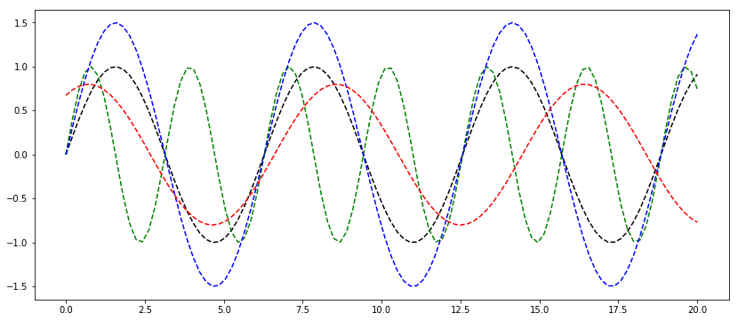

# Blogging with Jupyter

I realized that most of my blog posts behave like a jupyter notebook, so I am going evaluate if this is as nice as writing with prose.io.

## How it works
1. `git clone` the repo containing the jekyll blog
2. `jupyter notebook` run the notebook and write stuff
3. `ipython nbconvert <your_notebook>.ipynb --to markdown`
4. Move the generated markdown to the "\_posts" folder **Caution:** The images of this notebook are placed into a folder called `<your_notebook>_files`. 


```python
%matplotlib inline

import numpy as np
import matplotlib.pyplot as plt


plt.rcParams['figure.figsize'] = (14, 6)

x = np.linspace(0.0, 20.0, num=100)
y1 = np.sin(x)
y2 = np.sin(x*2)
y3 = 1.5 * np.sin(x)
y4 = 0.8 * np.sin(0.8*x + 1)

plt.plot(x, y1, 'k--', x, y2, 'g--', x, y3, 'b--', x, y4, 'r--')
```


    [<matplotlib.lines.Line2D at 0x7fed42f93710>,
     <matplotlib.lines.Line2D at 0x7fed42f937d0>,
     <matplotlib.lines.Line2D at 0x7fed42f93fd0>,
     <matplotlib.lines.Line2D at 0x7fed42f9d410>]




